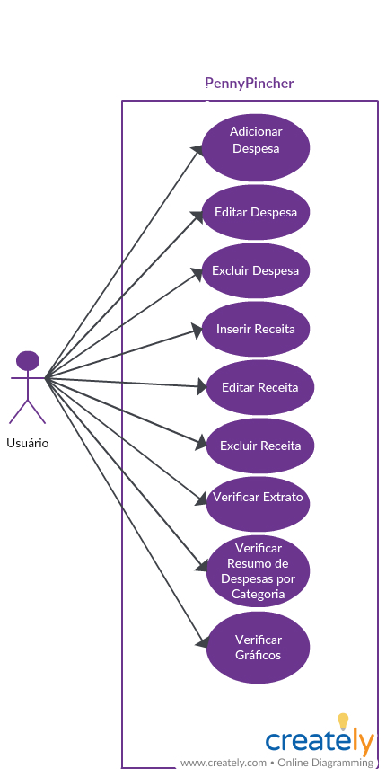

# Casos de uso

### 1.  Inserir despesas 

| Campo          | Informação        |
|---|---|
| Identificador: | UC01              |
| Nome:          | Inserir despesas |
| Atores:        | Usuário               |
| Sumário:       | Inserir despesas   |

| Fluxo Principal |
|---|
| 1) O usuário clica em Inserir Despesas.|
| 2) O usuário preenche o campo Data com a data de vencimentod a despesa.|
| 3) O usuário preenche o campo Descrição com a descrição da despesa.|
| 4) O usuário preenche o campo decimal Valor com o valor da despesa.|
| 5) O usuário seleciona o tipo de categoria da despesa.|
| 6) O usuário salva a nova despesa.|
| 7) O usuário seleciona a próxima ação.|

| Fluxo Alternativo (2a): A pagina web não consegue salvar as despesas.  |
|---|
| 1) A pagina web não consegue salvar as despesas  |
| 2) O usuário reinicia a pagina web. |
| 3) Volta ao passo (1) do fluxo principal. |

| Fluxo Alternativo (3a): Usuário não encontra Categoria de Despesa desejada  |
|---|
| 1) O usuário não encontra a Categoria de Despesa desejada ao inserir nova despesa    |
| 2) O usuário cadastra nova Categoria de Despesa |
| 3) Usuário salva a nova Categoria criada |
| 3) Volta ao passo (1) do fluxo principal. |

 ### 2.  Inserir Receita  

| Campo          | Informação        |
|---|---|
| Identificador: | UC02              |
| Nome:          | Inserir Receita |
| Atores:        | Usuário               |
| Sumário:       | Inserir  Receita |

| Fluxo Principal |
|---|
| 1) O usuário insere os  Receita  desejada. |
| 2) O usuário salva os novos  Receita .|
| 3) O usuário seleciona a próxima ação.|

| Fluxo Alternativo (2a): A pagina web não consegue salvar os  Receita   |
|---|
| 1) A pagina web não consegue salvar os  Receita  |
| 2) O usuário reinicia a pagina web. |
| 3) Volta ao passo (1) do fluxo principal. |

 ### 3.  Extrair relatório de gasto - mensal 

| Campo          | Informação        |
|---|---|
| Identificador: | UC03             |
| Nome:          |  Extrair relatório de gasto - mensal |
| Atores:        | Usuário               |
| Sumário:       |  Extrair relatório de gasto - mensal  |

| Fluxo Principal |
|---|
| 1) O usuário solicita qual o range temporal de informação que deseja visualizar.  |
| 2) A pagina web exibe em forma de gráfica as informações solicitadas pelo usuário.|
| 3) O usuário seleciona a próxima ação.|

| Fluxo Alternativo (2a): A pagina web não consegue exibir os gráficos com as informações solicitadas pelo usuário. |
|---|
| 1) A pagina web não cão consegue exibir os gráficos com as informações solicitadas pelo usuário |
| 2) O usuário reinicia a pagina web . |
| 3) Volta ao passo (1) do fluxo principal. |

